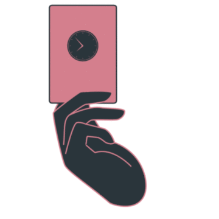
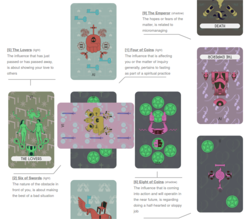

<br />

<p align="center">

  <h3 align="center">
    <a href='https://abetusk.github.io/ResonatorVoyantTarot'>Resonator Voyant Tarot</a>
  </h3>

  <p align="center">
    <a href='https://abetusk.github.io/ResonatorVoyantTarot'></a>
  </p>


  <p align="center">
    An experiment in creating generative tarot cards.
  </p>

</p>


## Table Of Contents

- [Table Of Contents](#table-of-contents)
- [Overview](#overview)
- [Quick Start](#quick-start)
- [License](#license)
- [Acknowledgements](#acknowledgements)
- [TODO](#todo)

## Overview



Resonator Voyant Tarot is an experiment in creating generative tarot cards.

Though steeped in spirituality, the reasons for doing a tarot reading need
not be mystical as it can be a source of creativity and help with
imaginative problem solving.

Each deck is created from a "vocabulary" of images with predefined rules
for joining them together.
Each card has a template with some fixed
elements and other random elements put together.

For example, a major arcana card of "The Fool" would have a fixed "fool"
image with randomly chosen elements coming out of the base. Another
 example is a minor arcana card that has the suite graphic (e.g.
"swords") positioned in a pattern appropriate for the numbered card
with a random "creature" created in the center.

Color palettes are also chosen randomly, with a consistent color
palette chosen for each suite. 

## Methodology

Each creature has attach points where items are placed.
Base creatures
are fixed for the non numbered minor arcana cards and then expanded
randomly, where numbered minor arcana cards have 'templates' for the
suite and have a center creature filled out randomly.

Each graphic item has different types of "attach points", labelled 'crown', 
'horns', 'arm', 'leg', 'tail' as well as a 'nesting box' area, along with 
another 'anchor' point, representing the bottom of the graphic.
Some items have 
restrictions on where they can attach but for the most part, any item can be 
placed at any other attach point.
Each attach point has a position and 
orientation, so kind of like a vector 'normal', so that newly attached 
creatures know where to be placed and how much to be rotated when attached.

When building a "creature", a new item is chosen at random and the new random 
creature is attached to one of an already placed item's attach point, shifting 
and rotating the new creature around it's anchor point and attaching it to one 
of the already placed creatures attach points.
The new creature is rescaled by 
a certain factor (say 0.5).
The nesting areas are chosen similarly except the 
rescale factor depends on the size of the nest box.
For the major arcana, a base creature is pre-chosen and fixed (chariot, 
empress, etc.) with random creatures attached to that base image, up to a 
certain depth (called the "complexity").
For the minor arcana, each card has a 
small library of "template card" where it has just nest boxes with predefined 
regions for the first N nestboxes, meant to have the suite item be placed in 
them, with the (N+1)th nestbox region somewhere in the center, meant for a 
creature.

By having attach points with different classes ('horns', 'arms', etc.), you can 
exploit a certain symmetry, so you only need to choose one creature for the 
'arm' attach point and repeat it.
For example, if the empress had an 'arm' 
attach point, one on each side, you could choose a 'snake' graphic on the left 
and repeat it on the right.
The convention is that odd attach point indexes 
have their y-axis flipped, so you can lend yourself well to the type of mirror 
symmetry seen in human and other animal body forms.

For items that have restrictions, different lists are built up with those 
restrictions so the random draw doesn't have to keep resampling.
When drawing a 
new creature, the space of available items is restricted so that you don't get 
into a situation where a major arcana base creature is being chosen in another 
card.
For example, the Emperor chooses from a list without the Empress, so that 
the Empress doesn't show up in a nestbox or at an attach point (and vice 
versa).
Same for all the card types, where the minor arcana don't draw from 
lists that have other minor arcana template cards in them.
The minor arcana 
also have most of the major arcana base creatures restricted, though some are 
allowed (like "death", "man_standing", "woman_standing", etc.) because they're 
generic enough to not be completely tied to the major arcana card.

For the "Lovers" and the "Justice" card, special processing is done.
For the 
"Lovers", there's no base graphic that represents the card, so a special 
"Lovers" template card of just nestboxes is used, with the man and women item 
always placed in two of the nestboxes and the rest chosen at random.
For the 
"Justice" card, I wanted the scales to hold different graphics, so the second 
right nestbox where the other part of scale is has a random item chosen instead 
of duplicating the one from the left part of the scale.

The minor arcana "Paige", "Knight", "Queen" and "King" cards have a base graphic
of a dog, horse, crown and other type of crown respectively, with a single suite
(pentacle, sword, etc.) item placed at the 'crown' attach point for the "Paige"
and "Knight" and attached at the 'tail' for the "Queen" and "King".
The rest of
the "Paige", "Knight", "Queen" and "King" creatures are built by randomly adding
other items to their free attach points.
The "Ace" has a base item chosen from a
restricted set ("book", "door", etc.) with the suite item placed in it's nesting
box, with no further random items attached.

The background image is built by choosing just one or two creatures and "tiling" 
them in the background.
Same with the "back" card but from a restricted set.

Two color schemes are chosen for each major arcana card, one for the background 
and one for the foreground creature.
Three color schemes are chosen, one for 
the background suite, one for the suite items themselves and another for the 
creature.
The color scheme is chosen so that the three color choices and their 
luminance are far enough away to be differentiable.
For each, as the creature 
is built up, the color schemes primary and secondary colors are swapped so that 
nested and attached items can be differentiated more clearly.


## Quick Start

[Live Demo](https://abetusk.github.io/ResonatorVoyantTarot/)

To run locally:

```
git clone https://github.com/abetusk/ResonatorVoyantTarot
cd ResonatorVoyantTarot
python3 -m http.server
```

```
firefox 'http://localhost:8000'
```

### Building

Building the main Javascript file, `browser-sibyl.js`, is pretty ad-hoc but
via:

```
cd scripts ; ./build.sh
```

This will create the `js/browser-sibyl.js` used as the engine to create the SVG
cards and has the data for SVG graphics and tarot reading.


## License

Unless otherwise specified, all original code and other artwork
is [CC0](https://creativecommons.org/publicdomain/zero/1.0/) licensed.


Artwork in the `_svg-vocabulary-pretty-printed.json` file is copyright Nina Paley and is
used by permission under a [CC-BY 4.0](https://creativecommons.org/licenses/by/4.0/) license.

Check for third party libraries to see individual licenses.

All third party libraries were chosen to be under a free/libre license, so please
check the individual libraries for their respective licenses.

## Acknowledgements

* Artwork in the `_svg-vocabulary-pretty-printed.json` file is copyright Nina Paley and is used by permission under a [CC-BY 4.0](https://creativecommons.org/licenses/by/4.0/) license.
* `alea.js` is copyright Johannes Baagø and is MIT licensed
* `jszip.js` is copyright Stuart Knightley and is dual licensed under the MIT license and GPLv3
* `pixi.js` is licensed under the MIT License
* `jquery.js` is copyright OpenJS Foundation and other contributors and is released under the MIT license
* `canvg` is copyright Gabe Lerner and is MIT licensed
* `skeleton.css` is copyright Dave Gamache and is MIT licensed
* `normalize.css` is MIT licensed

The above is a non-exhaustive list of software used.
Please see individual source files for their individual copyright.


## TODO

* Show card interpretations for the 'full deck' view
* Allow for suite elements to be rotated. Sword suites can have some 'texture' added to them with a little rotation.
* Allow for different suites other than the "default" four (swords, keys, pentacles, cups)
* Rotate cups (and maybe others) under Queen and King cards (or allow option to do so)
* Fix some of the color scheme where the background images appear indistinguishable from the background color
* Provide script to render SVG deck large enough for print
* Print a custom deck (one possibility is [makeplayingcards.com](https://www.makeplayingcards.com/promotional/personalized-tarot-cards.html))
