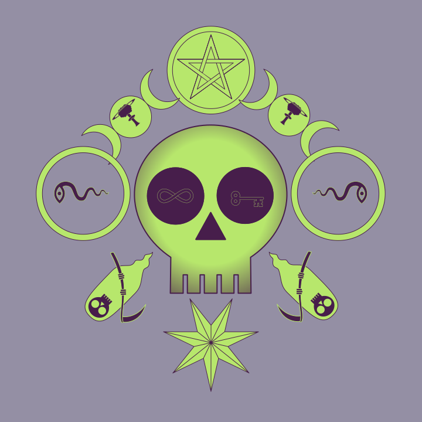

`sibyl.js`
---

```
version: 0.1.5

usage:

    sibyl [-h] [-v] [options] <svgjson> <command>

  <svgjson>                   svgjson file
  <command>                   random|<dsl>
  [-n nest-depth]             max nesting depth (default 2)
  [-a attach-depth]           max attach depth (default 1)
  [-S scale]                  rescale factor (default 0.5)
  [-G globalscale]            global scale (default 1)
  [-C complexity]             complexity factor (how many attach points for a random creature) (default 4)
  [-p color]                  set primary color (ex. '#000000') (default random)
  [-s color]                  set secondary color (ex '#ffffff') (default random)
  [-b color]                  set background color (ex. '#777777') (default random)
  [-c color]                  set background2 color (ex. '#888888') (default random)
  [-l linewidth]              set linewidth (default 4)
  [-B background-image]       set background image ('*' for random)
  [-T background-scale]       set background scale factor (default 0.5)
  [-D tiledx,tiledy]          shift tile background by tiledx,tiledy (ex. '-10,3') (default '0,0')
  [-E symbol]                 exclude items from random generation (e.g. 'bob,pipe')
  [-e exclude-file]           file with excluded symbols
  [-J svgjson]                add svgjson file to symbols (can be specified multiple times)
  [-j outjson]                output schedule JSON
  [-R injson]                 input schedule JSON
  [-L color]                  color ring (e.g. '#77777,#afafaf,#fe3f3f,#1f1f7f') (unimmplemented)
  [-g]                        disable gradient
  [-t]                        tile background
  [-Q]                        bonkers mode (override attach restrictions)
  [-h]                        show help (this screen)
  [-v]                        show version
```

#### Random Creature

```
./sibyl > out.svg
```

#### Creature With DSL


```
./sibyl 'skull @ [infinity,key] ^ pentacle ! (moons_triple@mushroom_cloud) ~ (ring@ snake_eye) | death . star_7pt' > out.svg
```


Description Language
---

Here is a simple character to highlight the syntax:

```
    !^!
[] ~(@)~ {}
     .
    | |
```

| Symbol | Meaning | Description |
|---|---|---|
| `^` | crown | |
| `!` | horn | |
| `~` | arm | |
| `@` | nesting | |
| `\|` | leg | |
| `.` | tail | |
| `()` | sub-expression | |
| `[]` | ring | |
| `{}` | random | |

For example, Here is a simple creature with most the features listed above:

```
skull @ [infinity,key] ^ pentacle ! (moons_triple@mushroom_cloud) ~ (ring@ snake_eye) | death . star_7pt
```

That produces

| |
|---|
|  |


The `ring` (`[]`) (not to be confused with the symbol `ring`) iterates through the list, modulo
the attach point index.

By default, the symbols are inverted every other index but an optional negation (`-`) can be
used in front of the symbol to reverse the direction.
This negation can be done for both nesting and other attach points.

Here are some examples to illustrate the idea:

| | |
|---|---|
| `face_nest @ hand_point ~ wing_angel2 ` |  |
| `face_nest @ [hand_point,-hand_point] ~ [wing_angel2,-wing_angel2]` |  |
| `face_nest @ [-hand_point,hand_point] ~ [-wing_angel2,wing_angel2]` |  |

The `{}` produces a random drawing from the list, with `*` being the 'universe' and a negation being a
removal of that item, with order mattering.
The `{}` can be thought of as a 'macro' with it expanding at "compile time".


For example, here is a creature, without Bob or his pipe:

| | |
|---|---|
| ` {*,-bob,-pipe} @ {*,-bob,-pipe} ^ ({*,-bob,-pipe} @ {*,-bob,-pipe}) ! ({*,-bob,-pipe}@{*,-bob,-pipe}) ~ {*,-bob,-pipe} \| {*,-bob,-pipe} . {*,-bob,-pipe} ` |  |

If a symbol doesn't have the attach points, the specified symbol will be ignored.

Gallery
---

| | | | |
|---|---|---|---|
| `./sibyl -t -T 0.25,0.185 -B '{*} @ {*} '` |  | `./sibyl -T 0.9 -B '{*} @ {*} '`  |  |
| ` ./sibyl -T 0.9 -B '{*} @ {*} '` |  | `./sibyl -T 0.5,0.35 -t -B '{*} @ {*} '` |  |
| `./sibyl -D 0,130 -T 0.59  -B 'hands_giving @ globe . crown '` |  | `./sibyl -t -T 0.125,0.076  -B '{*} @ {*}'` |   |

Other Features
---

`sibyl` has many options that aren't clearly apparent.

The DSL can be used to specify an image with a reserved token `:rnd` to call the random creature function.

Alternatively, a JSON syntax can be used that is of the form:

```
{
  "base": "box",
  "attach": {
    "arm": [ { "base": "fire_swirl" }, { "base": "fire_swirl" } ],
    "leg": [ { "base": "snake_eye" }, { "base": "snake_eye" } ],
    "crown": [
      {
        "base": "eyeball",
        "attach": {
          "nesting": [ { "base": "hand_point_2" } ]
        }
      }
    ],
    "nesting": [ { "base": "clouds" } ]
  }
}

```

Each name can have an optional negation at the beginning (`-`) to reverse the horizontal orientation in
addition to a hash (`#`) that specifies the foreground and background colors and a forward slash (`/`)
that specifies a rotation in degrees.

For example, here are all valid names:

```
goat
-goat
goat#fefefe
goat#fefefe#3f3f3f
-goat#fefefe/45
goat/35
```

The `-e` option can be used to specify a file to exclude certain symbols, with each symbol name
being on it's own line.
Blank lines and lines that begin with a hash (`#`) are ignored.

The `-j` option can be used to generate the JSON syntax for a creature.
For example, here is a random creature:

```
$ sibyl -j
{
  "base": "capricorn_tail",
  "attach": {
    "crown": [
      {
        "base": "crown",
        "attach": {
          "nesting": [ { "base": "dog" } ]
        }
      }
    ]
  }
}
```

The `-J` option can be used to input additional symbol svgjson files.
This is done to avoid having to constantly edit some base svgjson vocabulary file,
so new vocabulary svgjson symbols can be added easily.


---


Notes on Tarot
---

* The minor arcana tend to have the items suite be the same size
* The default minor arcana are wands, pentacles, cups, swords (wands are missing currently)
  - alternatives for wands: `antler,bone_vertical,branch,feather,key,unihorn,infinity,book_open,cube_die,cube_paradox`
  - alternatives for pentacles: `pentacle,scales,thistle,triskele,atom,bicycle,clock,egg`
  - alternatives for cups: `beaker,bottle,cup,heart,flower,lotus,pomegranite,pear,teacup,teardrop,urn`
  - alternatives for swords: `sword,knife,dagger,coffin,eagle_head,flame,lightning,lion_tail,mushroom_cloud,oroboros,pitchfork,saturn,trumpet`
* One idea is to have a few different arrangements for the cards (with crown or nestings, say) and then have a creature in the background
* Each suite and major arcana cold have have a 'theme' of a background
  - For complex backgrounds: sun rays, water, water with hills and trees, clouds
  - For simple backgrounds, could have a single symbol or repeating symbols (taken from `background=true` from the `.toml` files)

Major Arcana:

| | | | | |
|---|---|---|---|---|
| 0 `fool`       | 1 `magician` | 2 `priestess` | 3 `empress`  | 4 `emperor`     |
| 5 `hierophant` | 6 lovers (`[woman_stand,man_stand]`)  | 7 `chariot`   | 8 `strength` | 9 `hermit`      |
| 10 `wheel_of_fortune`     | 11 justice (`scales`) | 12 hanged  (`coffin`?)  | 13 `death` (`skull`,`skeleton`?)  | 14 temperance  (`waterworks`) |
| 15 `devil`     | 16 `castle_tower`   | 17 `starburst`     | 18 `moon`    | 19 `sun`        |
| 20 judgement (`angel`) | 21 `globe` |             |            |               |

[Wikipedia](https://en.wikipedia.org/wiki/Minor_Arcana) has the following table for the minor arcana:

| Primary suit  | Element | Class | Faculty |
|---|---|---|---|
| Wands, batons, clubs, staves  | Fire | Artisans  | Creativity and will |
| Pentacles, coins, disks, rings  | Earth | Merchants  | Material body or possessions |
| Cups, chalices, goblets, vessels  | Water | Clergy | Emotions and love |
| Swords, blades  | Air | Nobility and military | Reason  |


The minor arcana have the page, knight, queen and king.
There's a knight, but maybe the horse is more appropriate.
For the king and queen, it might be good enough to have a man and woman with a crown.
Maybe the baby for the page?

For the king/queen, it could be just picking two animals arbitrarily, like the rabbit, lamb, lion, bird,
with a crown and the suite symbol.
For the page, it could also be a random animal, same with the knight.
Here are some potential options:

* `bicycle`
* `bird`
* `bitey_half`
* `capricorn_tail`
* `cow_head`
* `dog`
* `eagle_head`
* `eagle_shield`
* `fish`
* `goat`
* `horse`
* `lamb_head`
* `lion`
* `rabbit`
* `tail_eagle`
* `tree_rooted`

Maybe also the wings?

So, here's a first stab:

| | |
|---|---|
| page | `bird,bird,dog,baby,rabbit` |
| knight | `bicycle,capricorn_tail,fish,goat,horse,tail_eagle` |
| queen | `bitey_half,cow_head,eagle_head,eagle_shield,lamb_head,lion,tree_rooted` |
| king | `bitey_half,cow_head,eagle_head,eagle_shield,lamb_head,lion,tree_rooted` |

Where the king and queen are drawn from the same list but chosen to be different symbols.
Maybe the king/queen also make sure to have a crown either for it's nesting or crown placement
and the suite for it's crown placement/nesting.

---

The tarot generation is going to be pretty complex.

All minor arcana will have to exclude the major arcana.
All major arcana will have to exclude all other major arcana symbols, except
the one in question, and suites of the minor arcana.
All minor arcana will have to exclude the other suites of the minor arcana
as well as exclude the suite symbol on all other levels and backgrounds, except
for the level/attachment point used to display the suite.

The minor arcana should have the suite be a different color from the background and
the foreground creature.
For cards in a given suite, the color scheme should be the same.

We might want to hard code background `hsv_val` depending.


---

The conclusion might be `sibyl` is good for experimentation and random stuff but
trying to shove all the intricacies and exceptions when creating a tarot deck,
say, might be beyond scope.

Instead of trying to shove all the random colors for different layers/symbols/whatever,
maybe it's better to just explicitly give them in the DSL or some JSON description.

Notes on SVG
---

```
       crown
 horn          horn
    arm     arm
      nesting 
    leg     leg
        tail

       anchor
```

Notes on TOML
---

| Field | Type | Description |
|---|---|---|
| `always_be_nested` | `bool` | Don't allow to be attached, only nested (including base object) |
| `always_nest` | `bool` | Always put a sub symbol inside of the nesting area |
| `attach_to` | `array` |  Only allow symbol to be attached to one in the list. If no `attach_to` specified, it defaults to `["tail","leg","arm","horn","crown"]`. `attach_to =[]` specifies that it shouldn't ever be attached (as per e.g. `angel`) |
| `background` | `bool` | Allow symbol to be a background image |
| `invert_nested` | `bool` | Invert every other time it's nested within a symbol |
| `never_be_nested` | `bool` | Never put symbol inside of a nesting |
| `rotate_clockwise` | `bool` | ? |

For `always_nest`, it's unclear if the symbol is restricted if it goes too far down the recursion
so that it would be impossible to nest an object therein.
That is, it's unclear whether the random choice should look ahead to see if a symbol
should not be chosen should it violate the `always_nest` option if it's too far down the recursion.

Notes on Tarot Reading
---

The "Celtic Cross Spread" ([wiki](https://en.wikibooks.org/wiki/Tarot_Card_Reading)) is a common one used.

The pattern is as follows:

```

     2
              9
 4  0/1  5    8
              7
     3        6

```

Where `1` is placed over `0` and `1` is positioned horizontally.

* `0` - The heart of the issue or influence affecting the matter of inquiry,
* `1` - The obstacle that stands in the way,
* `2` - Either the goal or the best potential result in the current situation,
* `3` - The foundation of the issue which has passed into reality,
* `4` - The past or influence that is departing,
* `5` - The future or influence that is approaching,
* `6` - You, either as you are, could be or are presenting yourself to be,
* `7` - Your house or environment,
* `8` - Your hopes and fears,
* `9` - The ultimate result or cumulation about the influences from the other cards in the divination


TODO
---

For deck generation:

* figure out how to rotate 'skinny' minor suits (e.g. swords)
  - consider pointing swords completely down
* cups under king/queen should be pointing up
* remove 'wavy' minor arcana template
* filter out minor arcana cards that bump into the numerals
* create description card
* create qr code card (?)
* fix background color value issues

---

* print custom deck
* write blog post about custom printing

#### references

* [pixi tutorial](https://github.com/kittykatattack/learningPixi#size-and-scale)
* [skeleton css](http://getskeleton.com/)
* [canvg](https://github.com/canvg/canvg)

Some ideas for names:

* `Resonator Voyant Tarot`
* `Callow Tarot`
* `Shallow Tarot`
* `Hollow Tarot`
* `Solo Tarot`
* `Hello Tarot`
* `Tarot Overflow`
* `Generatarot`
* `Lowbrow Tarot`
* `As Above, So Below Tarot`
* `Mandelbrot Tarot`
* `Hallow Tarot`
* `Low Tarot`
* `Tomorrow Tarot`
* `Harrowed Tarot`
* `Zero Tarot`
* `Teleprescent Metaphatic`
* `Autophetic Instrumancy`
* `Precognitive Piezoelectric Prophecy Generator`


Credits
---

Artwork in the `_svg-vocabulary-pretty-printed.json` is copyright Nina Paley, licensed under a [CC-BY-4.0](https://creativecommons.org/licenses/by/4.0/) license.

License
---

Unless otherwise stated, all code and data is licensed under a CC0 license.


